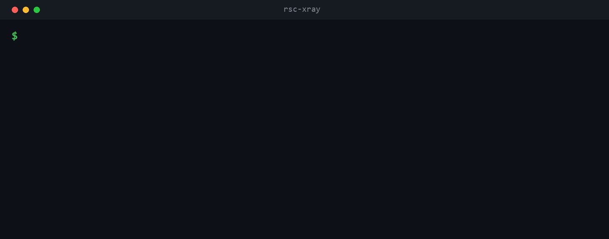

# rsc-gate

[](https://www.npmjs.com/package/rsc-gate)
[](https://github.com/TheSeydiCharyyev/rsc-gate/actions/workflows/ci.yml)
[](./LICENSE)

Catch React Server Component boundary bugs **before `next build`** — non-serializable props, `server-only` leaks, and accidental client bundling. Static, fast, and CI- and editor-friendly.

The server/client boundary in the App Router is invisible in your editor, and crossing it the wrong way fails at build or runtime with errors that don't point at the offending line. rsc-gate finds those mistakes statically — no build, no running your app — so they fail your PR instead of your deploy.



```text
rsc-gate v0.1.0 — ./app

BOUNDARIES  server → client
  app/page.tsx → components/Chart.tsx  imports: Chart

CLIENT-BUNDLED  no "use client", ships to the browser anyway — and here is why
  utils/format.ts
      app/page.tsx
      → components/Chart.tsx ("use client")
      → utils/format.ts

PROPS ACROSS BOUNDARIES  what server code hands to client components
  app/page.tsx:12 <Chart> (components/Chart.tsx)
      data      ok
      onPick    ✖ function — NOT serializable

SERVER-ONLY LEAKS  server-only code reachable from the client bundle
  components/Chart.tsx  imports "server-only"
```

## Usage

No install required — point it at a Next.js App Router project:

```bash
npx rsc-gate            # analyze the current directory
npx rsc-gate ./app      # analyze a specific project
```

Flags:

| Flag | Effect |
|------|--------|
| `--strict` | exit code `2` when a serialization hazard is found — for CI |
| `--explain <code>` | print a fix guide for a known RSC error |
| `--html [path]` | write a self-contained HTML report (default `rsc-gate-report.html`) |
| `--json` | machine-readable output |
| `--no-build` | skip reading `.next/` (boundary map only, no bundle cost) |
| `--no-color` | plain text |

## What it catches

- **Non-serializable props** — functions, class instances, and symbols handed from a Server Component to a Client Component, caught before `next build` fails at prerender. Server Actions are recognized and allowed.
- **`server-only` leaks** — server-only code reachable from a module that ships to the client.
- **Accidental client bundling** — the exact import chain that dragged a server-safe file across a `"use client"` boundary, so a stray import doesn't quietly grow your client bundle.
- **Boundary map** — which modules are server, which are client, and where each `"use client"` boundary sits. Matches the build's own client-reference manifest.
- **Bundle cost per boundary** *(optional)* — when a build exists, how many KB (and gzip) each client component ships, framework chunks separated from your own code.

## Why static, before build

These bugs surface late — at `next build`, at prerender, or in production — with messages that rarely name the file that caused them. Server Components and Server Functions ranked among the most-disliked React features in the State of React 2025 survey, with serialization and `"use client"` cognitive overhead cited as recurring pain. rsc-gate moves the check left: it runs without a build, in CI and in your editor, and names the offending line and import chain.

## How it works

Pure static analysis over your source via the TypeScript compiler API — it does **not** run your app or hook into React internals. Re-exports through barrel files are followed only for the names actually imported, matching bundler tree-shaking, so a client export in a shared barrel doesn't falsely mark its server siblings as client. The guiding rule is **no false positives**: a wrong warning costs more trust than a missed one.

With no build present it reports the boundary map, serialization checks, and server-only leaks. Run `next build` first (or drop `--no-build`) and it also reads `.next/` client-reference manifests to attribute real bundle bytes. Works with the Next.js App Router on Next 15 and 16.

## CI

Fail a pull request when someone crosses the boundary the wrong way:

```yaml
- run: npx rsc-gate --strict
```

`--strict` exits `2` when a serialization hazard is found, `0` otherwise.

## Documentation

- [Concepts](docs/concepts.md) — what each section means (boundaries, why-chains, prop verdicts, server-only leaks, bundle cost).
- [Programmatic API](docs/api.md) — call the analyzer from Node instead of the CLI.
- [Architecture decisions](docs/decisions.md) — why it is static-analysis-first and how barrels are handled.

## License

MIT
